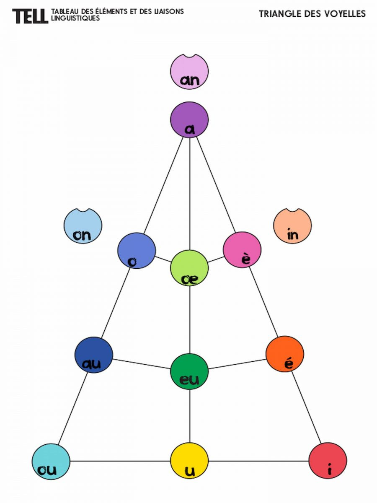

# French Vowels Web App

An interactive French vowel pronunciation guide with a visual vowel triangle. This project includes multiple versions to support different learning styles and use cases.



## Project Structure

```
French_vowels/
├── styles.css              # Shared CSS for all versions
├── README.md
├── assets/
│   ├── audio/
│   │   ├── vowels_fonetix_with_example/    # MP3 files with example words
│   │   ├── vowels_fonetix_without_example/ # MP3 files without example words
│   │   └── vowels_tts/                     # MP3 files robotic pronounciation
│   └── images/
│       └── TELL_Triangle_graphèmes-1.jpg   # Vowel triangle concept image
├── basic/
│   └── index.html          # Minimalist version with colored circles
├── text/
│   └── index.html          # Version with vowel names (o, è, a, etc.)
├── emoji/
│   └── index.html          # Version with Unicode emojis as visual aids
├── pictogram/
│   ├── index.html          # Version with PNG pictograms from pictograms folder
│   └── pictograms/         # Directory for custom PNG images (named by sound)
└── numbered/
    └── index.html          # Version with numbered vowel positions
```

## Versions

### 1. **Main Version** (`basic/index.html`)
- Colored circles with text labels over triangles

### 2. **Written Version** (`text/index.html`)
- Displays vowel names over colored circles on the triangles

### 3. **Emoticons Version** (`emojis/index.html`)
- Uses Unicode emojis as visual mnemonics over colored circles on the triangles
- Avoids usage wrights as emojis are free tu use

### 4. **Number Version** (`numbered/index.html`)
- Displays numbers which contain the vowel sound over colored circles on the triangles
- Includes 10/13 vowels (au, o, é don't have numbers)

### 5. **Icons Version** (`picrogram/index.html`)
- Uses PNG pictograms from the `pictograms/` folder
- **Dynamic loading:** Automatically matches PNG filenames to sound names
- **Easy customization:** Add or replace PNG files with the same naming convention
- **File naming:** `pictograms/{sound}.png` (e.g., `pictograms/a.png`, `pictograms/o.png`)

## CSS Organization

The `styles.css` file is organized as follows:

1. **CSS Variables** - Define colors, sizes, and transitions for easy theming
2. **Reset/Base Styles** - Box-sizing and foundational body styling
3. **Component Styles** - Typography and SVG positioning
4. **Interactive Elements** - Hover and active states for touch/click feedback
5. **Responsive Design** - Mobile-first media queries for screens ≤480px
6. **Utility Classes** - Reusable classes for future enhancements

## Features

### Desktop & Mobile
- ✅ **Fully responsive design** - Works seamlessly on phones, tablets, and desktops
- ✅ **Interactive vowel circles** - Click/tap any circle to play pronunciation audio
- ✅ **Audio toggle** - Switch between vowel sounds only or with example words
- ✅ **Visual feedback** - Hover effects on desktop, active states on mobile/touch devices
- ✅ **Touch-optimized** - No touch delay, proper `touch-action` handling

### Audio
- ✅ **MP3 pronunciation files** - From [Fonetix.org](https://fonetix.org/fr/etudier/ressources)
- ✅ **Two versions available:**
  - `assets/audio/vowels_fonetix_with_example/` - Includes example words with each vowel
  - `assets/audio/vowels_fonetix_without_example/` - Vowel sounds only
- ✅ **Auto-mapped to sounds** - Filenames match the vowel sound names (e.g., `o.mp3`, `a.mp3`)

### Visual Design
- ✅ **SVG-based triangle** - Scalable, responsive vowel triangle
- ✅ **Color-coded vowels** - Each vowel has a unique color for quick identification
- ✅ **Smooth animations** - Transitions on hover/active states
- ✅ **Subtle shadow effects** - Professional, modern appearance

## Development

### Modifying Styles
- Edit `styles.css` directly
- Uses CSS custom properties (variables) for easy color/size adjustments
- Media queries ensure mobile responsiveness

### Adding/Updating PNG Icons (Icons Version)
1. Create PNG files of your choice
2. Place them in `icons/pictograms/` folder
3. Rename each PNG to match a vowel sound (e.g., `a.png`, `o.png`, `oe.png`)
4. The app automatically loads and positions them on the circles
5. If a PNG is missing, the colored circle displays instead

### Customizing Emojis (Emoji Version)
- Open `emoji/index.html`
- Find the `<text>` element inside each `<g class="vowel">` group
- Replace the emoji character directly (e.g., change `❤️` to your preferred emoji)
- No JavaScript needed — changes are instant

### File Naming Convention
All PNGs in `pictogram/pictograms/` should match these sound names exactly:
- Oral vowels: `a`, `o`, `oe`, `è`, `eu`, `au`, `é`, `ou`, `u`, `i`
- Nasal vowels: `an`, `on`, `in`

## Browser Compatibility

- ✅ Chrome/Edge (full support)
- ✅ Firefox (full support)
- ✅ Safari (full support, including iOS)
- ✅ Mobile browsers (iOS Safari, Chrome Mobile, etc.)

## Attribution

**Vowel Triangle Concept:** Inspired by [Sophia Smajlovic's work at UNIL](https://wp.unil.ch/ficellesapprendre/sophia-smajlovic-1142/)

**Audio files:** French pronunciation resources from [Fonetix.org - Étudier le français](https://fonetix.org/fr/etudier/ressources)
